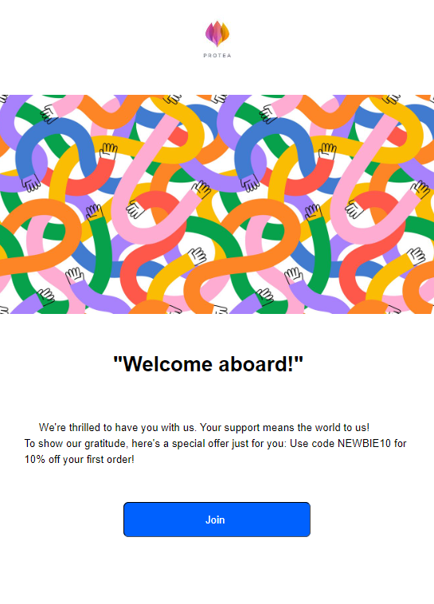
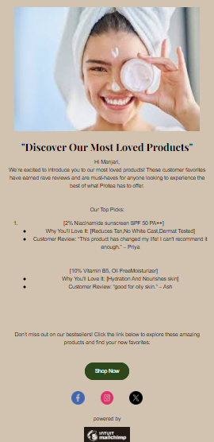

## Email 1: Welcome and Introduction

Purpose: To greet the new subscriber and introduce the brand.
Content: Thank the subscriber for joining, provide an overview of what they can expect, and share a special welcome offer or discount.
screenshot :

 ## Email 2: Brand Story and Values

Purpose: To build a connection with the subscriber by sharing the brand's story and core values.
Content: Tell the story of how the brand started, highlight key values.
screenshort : 

## Email 3: Highlight Popular Products and Encourage Engagement

Purpose: To showcase popular products and encourage the subscriber to engage with the brand.
Content: Highlight best-selling products, invite subscribers to follow on social media, and include a call-to-action to visit the website or blog.
screenshort:
